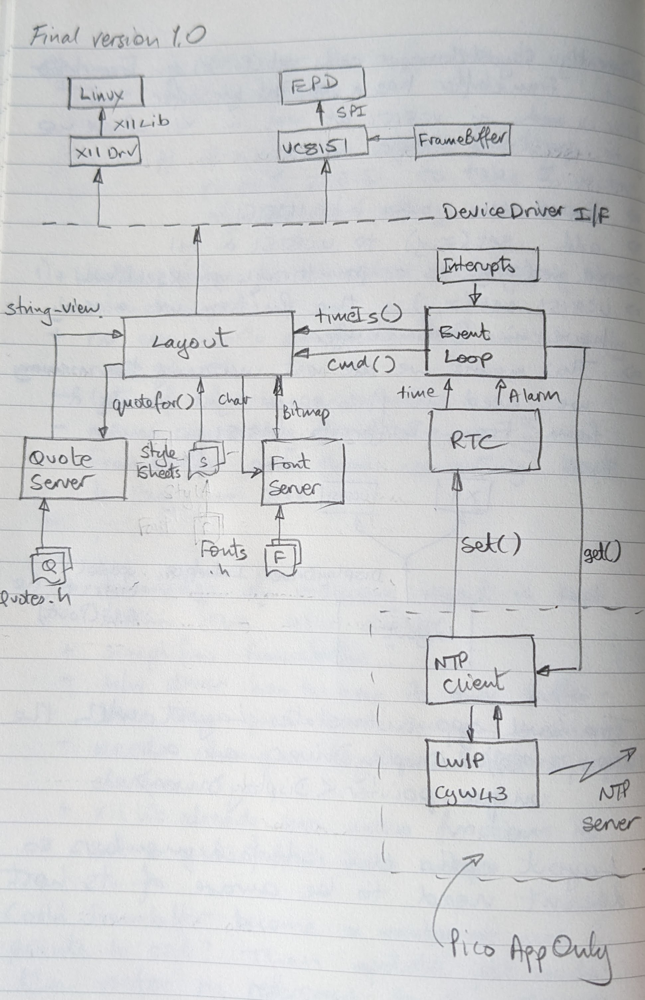

# Notes

## Executables
### epdc.cpp 
- Generates the elf (or uf2) to be flashed on the Pico W

### desktop.cpp 
- A linux X11 app originally meant for testing the font rendering. The executable is called xclock.

### fontGenerator.cpp 
- A linux cmd line app to generate embeddable (.h) files from standard Adobe BDF files

### textGenerator.cpp 
- A linuc cmd line app to gnerate embeddable (.h) text assets from .tsv spreadsheet files


## Dependencies
Building the X11 version needs the X11 headers. These are installed with this:
```console
sudo apt install libx11-dev
```

## Building
The pico and Linux versions both build to their respective subdirectories in the build directory.
I can't get CMAKE to use different kits in a single config run so the process for building is:
* set the either arm-none-eabi or the x86_64-linux-gnu kit
* run the CMAKE configure task
* run the CMAKE build task
* select the other kit
* re-run the configure task
* re-run the build task


## Flashing 
Since RP's stealth upgrade of the picoprobe protocol the signature of the openocd call is:
```console
openocd -f interface/cmsis-dap.cfg -f target/rp2040.cfg -c "adapter speed 5000" -s tcl
```

## Debugging
F5 should trigger the launch.json tasks and start the gdb server. 


## TODO
* Improve the font rendering or use a font better suited to the low res badger epd
* Add power control so we can use the new Badger W board
* Finish style sheet support so we can use multiple fonts
* Finish add a function to textGenerator.cpp so set the font size according to the 
length of the quote
* Check for multiple entries in quoteServer and cycle through these
* Finish the cmd stub so we can do something with the buttons
* Add and mqtt client so the button can select (e.g. temp display) instead of time

</br>

## An Inaccurate Approximation of the Architecture
